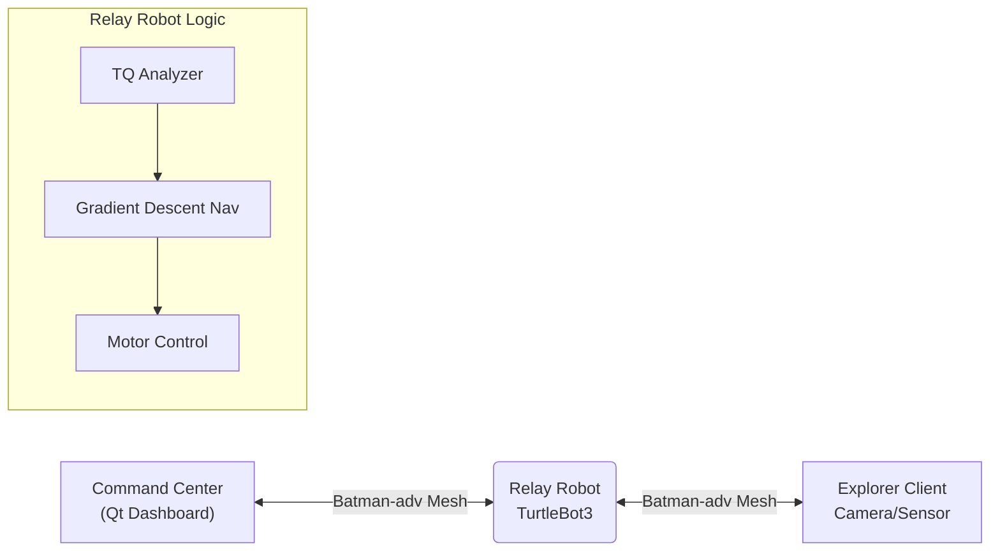

# 📡 QoS-Aware Autonomous Mobile Mesh Relay System

### 통신 음영 지역(NLOS) 극복을 위한 자율 이동형 메시 중계 시스템

> **Intel Edge AI SW Academy 8th Gen - Team 4 Project** > **개발 기간:** 2025.11.21 ~ 2026.1.5

---

## 📖 프로젝트 개요 (Overview)

재난 현장이나 지하 통로와 같이 기존 통신 인프라(LTE/5G)가 붕괴되거나 닿지 않는 **음영 지역(NLOS)**에서, Client와 Server 간의 **통신 단절을 스스로 감지하고 복구하는 이동형 중계 로봇 시스템**입니다.

단순한 신호 증폭기와 달리, 로봇이 통신 품질(TQ/RSSI)을 실시간으로 분석하여 **최적의 중계 위치로 스스로 이동**함으로써 끊김 없는 영상 전송 환경을 보장합니다.

### 💡 핵심 기능 (Key Features)

* **📡 자가 치유 네트워크 (Self-Healing Network):** `batman-adv` 기반 Layer 2 Mesh Network를 구성하여 IP 설정 없이 즉각적인 노드 합류 및 경로 복구 지원.
* **🤖 통신 품질 기반 자율 주행 (Connectivity-Aware Navigation):** TQ(Transmission Quality) 및 RSSI 데이터를 기반으로 통신 품질이 저하되는 지점(Gradient Descent)을 예측하여 최적 위치로 이동.
* **🧱 NLOS(비가시권) 극복:** 코너나 장애물로 인한 신호 감쇄 시, 로봇이 중계 거점으로 이동하여 물리적 통신 링크 연결.
* **🖥️ 실시간 모니터링 GUI:** Qt 기반의 대시보드를 통해 로봇의 위치, 배터리 상태, 네트워크 토폴로지 및 TQ 값을 실시간 시각화.

---

## 🛠️ 시스템 아키텍처 (System Architecture)

본 시스템은 **ROS 2**를 미들웨어로 사용하며, **Batman-adv** 커널 모듈을 통해 투명한(Transparent) 메시 네트워크를 형성합니다.



### 📂 디렉토리 구조 (Directory Structure)

```text
Intel-4th-Project
├── 📂 comm_pkg                   # Batman-adv 및 네트워크 상태 모니터링 모듈 (Non-ROS)
└── 📂 ros2_turtlebot_createdpkg  # ROS 2 핵심 패키지
    ├── 📂 relay_bot_pkg          # [Core] 통신 품질 기반 자율 주행 노드 (Nav2 미사용, 자체 알고리즘)
    └── 📂 robot_Qt               # [GUI] 관제 센터용 Qt 대시보드 어플리케이션

```

---

## 🎥 시연 시나리오 (Demonstration)

### 1. 코너(Corner) 극복 시나리오

> 탐사 로봇이 코너를 돌아 통신이 끊기기 직전, 중계 로봇이 코너 입구로 이동하여 링크를 유지합니다.

### 2. 거리 연장(Line Extension) 시나리오

> 탐사 거리가 멀어짐에 따라 TQ 값이 임계치 이하로 떨어지면, 중계 로봇이 전진하여 통신 가능 거리를 확장합니다.

---

## 🚀 설치 및 실행 (Installation & Usage)

### 사전 요구 사항 (Prerequisites)

* **Hardware:** TurtleBot3 (Burger/Waffle), Raspberry Pi 4, USB Wi-Fi Dongle (Mesh mode 지원)
* **OS:** Ubuntu 22.04 LTS (Jammy Jellyfish)
* **ROS 2:** Humble Hawksbill

### 빌드 및 실행

```bash
# 1. 워크스페이스 이동 및 클론
cd ~/turtlebot3_ws/src/
git clone https://github.com/seolihan651/Intel-4th-Project.git

# 2. 의존성 설치 및 빌드
cd ~/turtlebot3_ws
colcon build --symlink-install
source install/local_setup.bash

# 3. Batman-adv 설정 (각 노드에서 실행)
sudo bash comm_pkg/scripts/setup_batman.sh

# 4. 중계 로봇 노드 실행
ros2 launch relay_bot_pkg relay_system.launch.py

# 5. Qt GUI 실행 (PC)
ros2 run robot_Qt gui_dashboard

```

---

## 👥 개발팀 소개 (Team Members)

| 역할 | 이름 | 담당 업무 | GitHub |
| --- | --- | --- | --- |
| **팀장** | **김성준** | 프로젝트 총괄, ROS2 자율 주행 알고리즘 구현 | [@seolihan651jw](https://github.com/seolihan651) |
| **팀원** | **김영교** | Batman-adv Mesh 네트워크 구축 및 커널 모듈 최적화 | [@mmc47047](https://github.com/mmc47047) |
| **팀원** | **윤찬민** | Qt GUI 대시보드 개발, 시스템 통합 테스트 | [@CMYMC](https://github.com/CMYMC) |
| **팀원** | **정찬영** | ROS2 센서 데이터 처리 및 하드웨어 제어 | [@salnock](https://github.com/salnock) |

---

## 📜 License

This project is licensed under the MIT License - see the [LICENSE](https://www.google.com/search?q=LICENSE) file for details.
