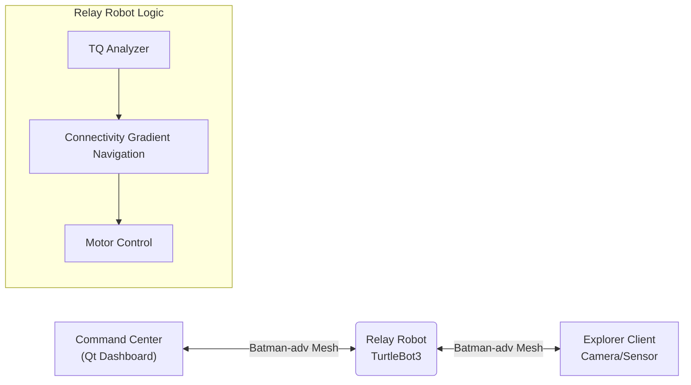

# 📡 QoS-Aware Autonomous Mobile Mesh Relay System
**Self-healing Mobile Relay Robot for Infrastructure-less Disaster Communication**
> BATMAN-ADV 메시 네트워킹과 연결성 인식 내비게이션을 사용하여 
> NLOS 및 재난 환경에서 고장난 통신 링크를 자율적으로 복구하는  
> 모바일 중계 로봇 시스템입니다.

### 통신 음영 지역(NLOS) 극복을 위한 자율 이동형 메시 중계 시스템

> **Intel Edge AI SW Academy 8th Gen - Team 4 Project** > **개발 기간:** 2025.11.21 ~ 2026.1.5

---

## 📖 프로젝트 개요 (Overview)

재난 현장, 지하 통로, 터널과 같은 환경에서는 구조 인력의 이동에 따라  
기존 통신 인프라(LTE/5G)가 급격히 약화되거나 완전히 단절되는 문제가 반복적으로 발생합니다.  
고정형 중계기나 단순 신호 증폭 방식은 이러한 동적인 환경 변화에 효과적으로 대응하기 어렵습니다.

본 프로젝트는 이러한 한계를 해결하기 위해,  
통신 품질(TQ/RSSI)을 실시간으로 분석하고 **중계 로봇이 직접 이동하여  
통신 경로를 물리적으로 재구성하는 자율 이동형 메시 중계 시스템**을 제안합니다.

### 💡 핵심 기능 (Key Features)

* **📡 자가 치유 네트워크 (Self-Healing Network):** - BATMAN-ADV 기반 Layer 2 메시 네트워크
- 중앙 AP, IP 설정, NAT/DHCP 없이 노드 자동 합류 및 경로 복구

* **🤖 통신 품질 기반 자율 주행 (Connectivity-Aware Navigation):** - Nav2/SLAM 미사용
- 링크 품질(TQ/RSSI)을 목적 함수로 하는 Gradient-based 이동 제어
- 지도 없이 통신 품질을 직접 최적화

* **🧱 NLOS(비가시권) 극복:** - 코너, 장애물, 거리 증가로 인한 통신 단절을 물리적 중계로 해결
* **🖥️ 실시간 모니터링 GUI:** - 네트워크 토폴로지, TQ, 로봇 상태를 직관적으로 시각화

---

## 🧠 디자인 근거(Design Rationale)

- Why BATMAN-ADV?
  - 자가 치유 기능을 갖춘 L2 메시 라우팅
  - 노드 이동성 및 인프라 장애에 강인함
  - 재난 및 임시 네트워크에 적합

- Why Gradient-based Navigation?
  - 위치 정확성이 아닌 커뮤니케이션 품질이 주요 목표
  - 사전 지도나 위치 확인이 필요 없음
  - 불안정한 환경에 적합한 가볍고 반응형 제어


---

## 🛠️ 시스템 아키텍처 (System Architecture)

본 시스템은 **ROS 2**를 미들웨어로 사용하며, **Batman-adv** 커널 모듈을 통해 투명한(Transparent) 메시 네트워크를 형성합니다.



### 📂 디렉토리 구조 (Directory Structure)

```text
Intel-4th-Project
├── 📂 comm_pkg                   # Batman-adv 및 네트워크 상태 모니터링 모듈 (Non-ROS)
└── 📂 ros2_turtlebot_createdpkg  # ROS 2 핵심 패키지
    ├── 📂 relay_bot_pkg          # [Core] 통신 품질 기반 자율 주행 노드 (Nav2 미사용, 자체 알고리즘)
    └── 📂 robot_Qt               # [GUI] 관제 센터용 Qt 대시보드 어플리케이션

```

---

## 🎥 시연 시나리오 (Demonstration)

### 1. 코너(Corner) 극복 시나리오

> Without Relay

- 탐사 로봇이 코너를 돌아가면 통신 링크가 급격히 약화되거나 완전히 단절됨

> With Mobile Relay

- 통신 품질(TQ) 저하를 감지한 중계 로봇이 코너 입구로 이동
- 메시 네트워크가 재구성되며 영상 스트림 유지

### 2. 거리 연장(Line Extension) 시나리오

> Without Relay

- 탐사 거리가 증가함에 따라 통신 품질이 임계치 이하로 하락
- 영상 프레임 드롭 및 연결 불안정 발생

> With Mobile Relay

- 중계 로봇이 전진하여 최적 중계 위치 확보
- 통신 가능 거리 및 링크 안정성 확장

---

## 🎥 Demo Videos

### NLOS Recovery Demo


## 🚀 설치 및 실행 (Installation & Usage)

### 사전 요구 사항 (Prerequisites)

* **Hardware:** TurtleBot3 (Burger/Waffle), Raspberry Pi 4, USB Wi-Fi Dongle (Mesh mode 지원)
* **OS:** Ubuntu 22.04 LTS (Jammy Jellyfish)
* **ROS 2:** Humble Hawksbill

### 빌드 및 실행

```bash
# 1. 워크스페이스 이동 및 클론
cd ~/turtlebot3_ws/src/
git clone https://github.com/seolihan651/Intel-4th-Project.git

# 2. 의존성 설치 및 빌드
cd ~/turtlebot3_ws
colcon build --symlink-install
source install/local_setup.bash

# 3. Batman-adv 설정 (각 노드에서 실행)
sudo bash comm_pkg/scripts/setup_batman.sh

# 4. 중계 로봇 노드 실행
ros2 launch relay_bot_pkg relay_system.launch.py

# 5. Qt GUI 실행 (PC)
ros2 run robot_Qt gui_dashboard

```

---

## 👥 개발팀 소개 (Team Members)

| 역할 | 이름 | 담당 업무 | GitHub |
| --- | --- | --- | --- |
| **팀장** | **김성준** | 프로젝트 총괄, ROS2 자율 주행 알고리즘 구현 | [@seolihan651jw](https://github.com/seolihan651) |
| **팀원** | **김영교** | Batman-adv Mesh 네트워크 구축 및 커널 모듈 최적화 | [@mmc47047](https://github.com/mmc47047) |
| **팀원** | **윤찬민** | Qt GUI 대시보드 개발, 시스템 통합 테스트 | [@CMYMC](https://github.com/CMYMC) |
| **팀원** | **정찬영** | ROS2 센서 데이터 처리 및 하드웨어 제어 | [@salnock](https://github.com/salnock) |

---

## ⚠️ 제한 사항 및 향후 작업

- RSSI/TQ 변동으로 인해 릴레이 움직임에 국부적인 진동이 발생할 수 있습니다
- 단일 릴레이 시나리오; 다중 릴레이 조정은 향후 작업입니다
- 장애물 인식 내비게이션은 더 복잡한 환경에 통합될 수 있습니다

---

## 🧠 기술적 시사점(Technical Takeaways)

- 배트맨-ADV를 사용하여 레이어 2 메시 네트워크를 구현하고 기존 IP 라우팅과의 차이점을 이해
- SLAM이나 Nav2에 의존하지 않고 연결성을 인식하는 내비게이션 알고리즘을 설계
- 실제 환경에서 RSSI/TQ 노이즈와 반응 제어의 실용적인 도전 과제 학습
- ROS 2, 리눅스 네트워킹 및 임베디드 시스템을 단일 자율 시스템에 통합

---

## 📜 License

This project is licensed under the MIT License - see the [LICENSE](https://www.google.com/search?q=LICENSE) file for details.
